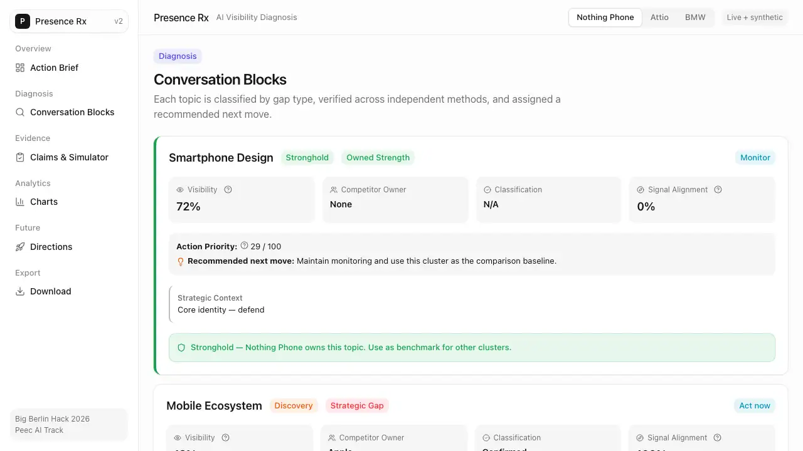
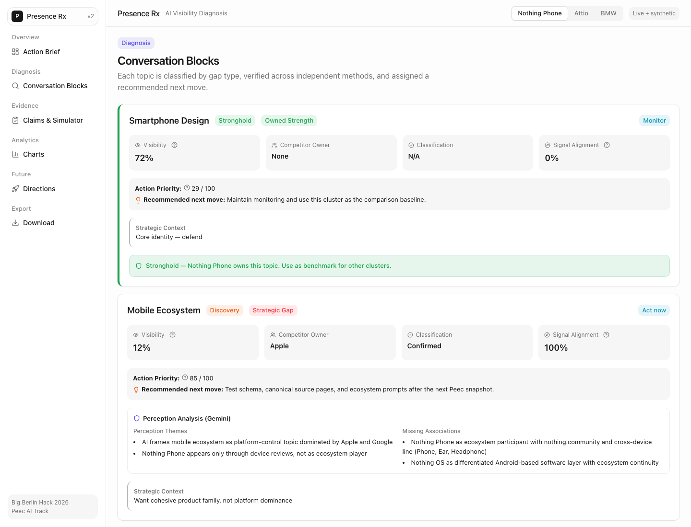
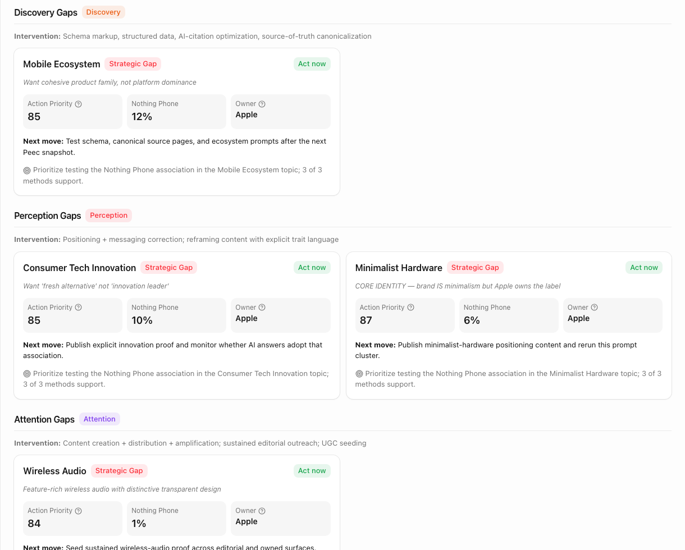
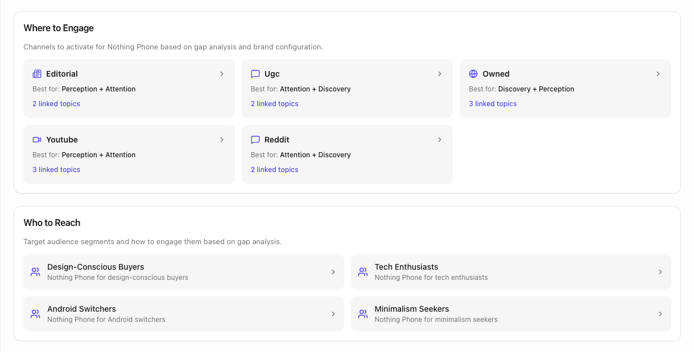
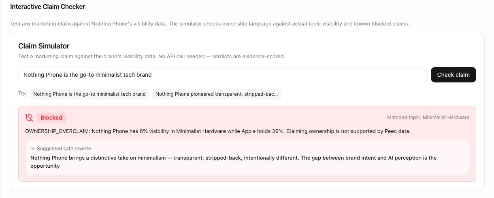
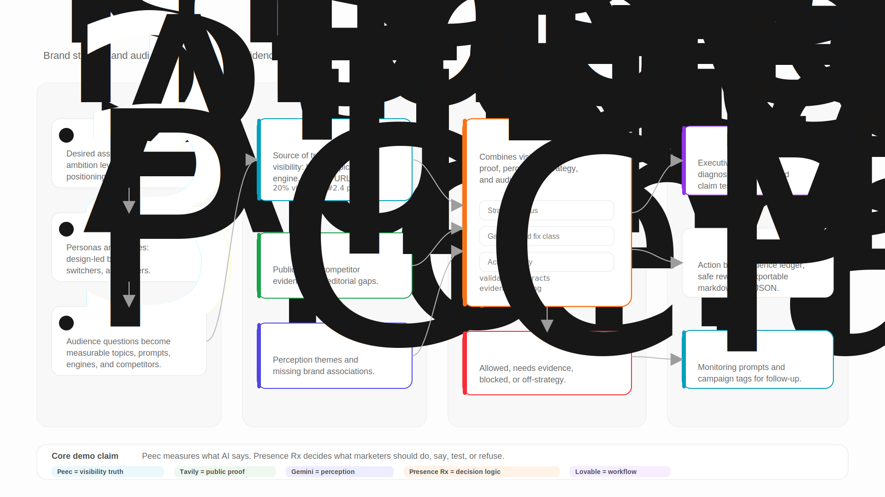

# Presence Rx

### Turn AI visibility gaps into evidence-backed marketing decisions: what is wrong, what to do, where to activate, and what not to claim.

> **Diagnose. Prescribe. Refuse.**

Presence Rx is the decision layer on top of Peec AI. Peec shows how a brand appears in AI answers. Presence Rx classifies the gap, recommends the intervention, maps the channels to activate, and blocks marketing claims the evidence does not support.

[](docs/demo-assets/gap-analysis.png)

---

## Why This Exists

AI answers are becoming a discovery surface. When someone asks ChatGPT, Gemini, or Google AI Overview for a product recommendation, your brand is either in the answer or it is not.

The hard part is not only measuring visibility. The hard part is deciding what kind of marketing problem the visibility gap represents.

- A **perception gap** means AI knows the brand, but associates the category language with someone else.
- A **discovery gap** means the brand has relevant content, but AI does not surface it in answers.
- An **attention gap** means the brand or product exists, but public signal is too thin or too infrequent.

Those gaps need different actions. Presence Rx makes that distinction explicit, then turns it into an evidence-backed action brief.

---

## Hero Features

### 1. Gap Analysis

Presence Rx starts with Peec MCP visibility data and turns it into a strategic diagnosis across topics, competitors, engines, and evidence sources.

For the flagship Nothing Phone case, the core finding is the **Invisible Champion** pattern:

| Signal | Finding |
| --- | --- |
| Overall visibility | 20% of AI answers mention Nothing Phone |
| Overall position | 2.4, best when mentioned |
| Stronghold | Smartphone Design at 72% visibility |
| Core perception gap | Minimalist Hardware at 6% while Apple holds 39% |
| Attention gap | Wireless Audio at 1% while Apple holds 53% |

The diagnosis does not stop at "low visibility." Each blind spot is classified as **perception**, **discovery**, or **attention**, with a confidence tier and source trail.



### 2. Strategic Action

Each gap type maps to a different intervention class.

| Gap Type | What It Means | Strategic Action |
| --- | --- | --- |
| Perception | AI gives the desired association to a competitor | Reframe positioning and publish explicit trait-language proof |
| Discovery | Relevant content exists but is not cited in AI answers | Improve canonical pages, schema, source-of-truth structure, and monitor retrieval |
| Attention | Product proof exists but public signal is sparse | Build sustained content, earned coverage, and community proof |

The action brief prioritizes each topic, explains why it matters, names the competitor owner, and gives the next move. For Nothing Phone, that means treating Minimalist Hardware as a perception problem, Mobile Ecosystem as a discovery problem, and Wireless Audio as an attention problem.



### 3. Channel Activation

Presence Rx then converts the issue type into a channel plan. The built dashboard maps gaps to channel families and audience segments:

| Channel | Best For | Example Use |
| --- | --- | --- |
| Owned content | Discovery + perception | Canonical pages, structured data, FAQ modules, comparison pages |
| Earned / editorial | Perception + attention | Reviewer outreach, listicle inclusion, design and category press |
| Creator / UGC | Attention + discovery | YouTube reviews, Reddit threads, community proof |
| Review and comparison surfaces | Discovery + perception | Category comparison pages and high-citation review sites |
| Monitoring prompts | Measurement loop | Peec prompts and tags to track whether activation closes the gap |

The public `/future` page goes one step further as an illustrative preview of brand-lift and budget-allocation planning. It is clearly marked as modeled, not measured. The reproducible deliverable is the diagnostic and action pipeline above.



### 4. Claim Simulation

After the strategy is formed, Presence Rx checks what the brand is allowed to say.

A marketer tests:

> *"Nothing Phone is the go-to minimalist tech brand."*

Presence Rx blocks it. Peec visibility data shows Nothing Phone at 6% visibility in Minimalist Hardware while Apple holds 39%. Claiming ownership is not supported.

It gives a safer rewrite:

> *"Nothing Phone brings a distinctive take on minimalism — transparent, stripped-back, intentionally different. The gap between brand intent and AI perception is the opportunity."*

The point is not only what to say. It is what the brand has **earned the right to say**.



---

## What Ships

Presence Rx ships those hero features as a reproducible case pipeline and dashboard for Nothing Phone, with additional generated cases for Attio and BMW.

| Surface | What It Shows |
| --- | --- |
| Presence Verdict | Executive diagnosis, topic gaps, confidence tiers, and source-of-record summary |
| Action Brief | Gap-type interventions, prioritized next moves, safe publication language, and monitoring plan |
| Activation Brief | Owned, earned, comparison, FAQ, audience, and channel actions by gap type |
| Evidence Ledger | Machine-readable claims, evidence refs, tiers, publication status, and blocked claims |
| Dashboard | Diagnosis, action brief, analytics, claim simulator, export tools, and future-direction preview |

The flagship case includes a verified Peec MCP visibility snapshot, Tavily public-web evidence, and a Gemini-compatible perception-analysis artifact grounded in the gap topics.

---

## Architecture



### Source-Of-Record Discipline

| Source | What It Provides |
| --- | --- |
| **Peec AI** | Visibility truth: topics, positions, competitors, engines, source signals, and monitoring setup |
| **Tavily** | Public web evidence: editorial citations, competitor proof, proof-gap enrichment |
| **Gemini / analysis contract** | Perception analysis: themes, missing associations, narrative diagnostics; artifacts record whether the run was live or substitute |
| **Presence Rx** | Decision layer: gap classification, action priority, channel mapping, claim ceilings, safe rewrites |

Every metric traces to a named source. The system does not blend measured visibility, public web evidence, and generated analysis without attribution.

### What We Deliberately Do Not Claim

- Presence Rx does not replace Peec. Peec is the measurement source of record.
- Future-direction brand-lift and allocation numbers are modeled previews, not measured campaign results.
- Checked-in Gemini artifacts record their run mode. If live API quota is unavailable, the pipeline uses a contract-valid substitute and should not be represented as a live Gemini call.
- The claim simulator is intentionally conservative. It would rather block a borderline claim than let an overclaim through.

---

## Run It

Requires Node.js 18.17+ with npm for the dashboard. The Python pipeline requires Python 3.11+ and `uv`.

```bash
cd webapp
npm install
npm run dev
```

Open [localhost:3000](http://localhost:3000). Select a brand and start with the Action Brief or Diagnosis view.

### Pipeline And Verification

```bash
uv sync --dev
make run
make validate
make test
make lint

cd webapp
npm run build
npm run lint
```

---

## Built With

- [Peec AI](https://peec.ai) MCP — AI visibility source of record and monitoring setup
- [Tavily](https://tavily.com) — public web evidence enrichment
- [Gemini](https://deepmind.google/technologies/gemini/) / `google-genai` — perception-analysis path and missing-association contract
- [Next.js](https://nextjs.org), React, Tailwind CSS, Recharts, and lucide-react — marketer-facing dashboard
- Python, Typer, Pydantic, pandas, pytest, and Ruff — pipeline, artifact contracts, validation, and tests

---

## Project Posture

Presence Rx was built for the Peec AI track at Big Berlin Hack 2026.

The public repo keeps the boundary clear: reproducible Peec/Tavily/Gemini-backed diagnostics are in scope; any future channel-allocation work that depends on private benchmark data is shown only as a labeled static preview.

**Solo build by Amit Prusty with AI-assisted development.**
