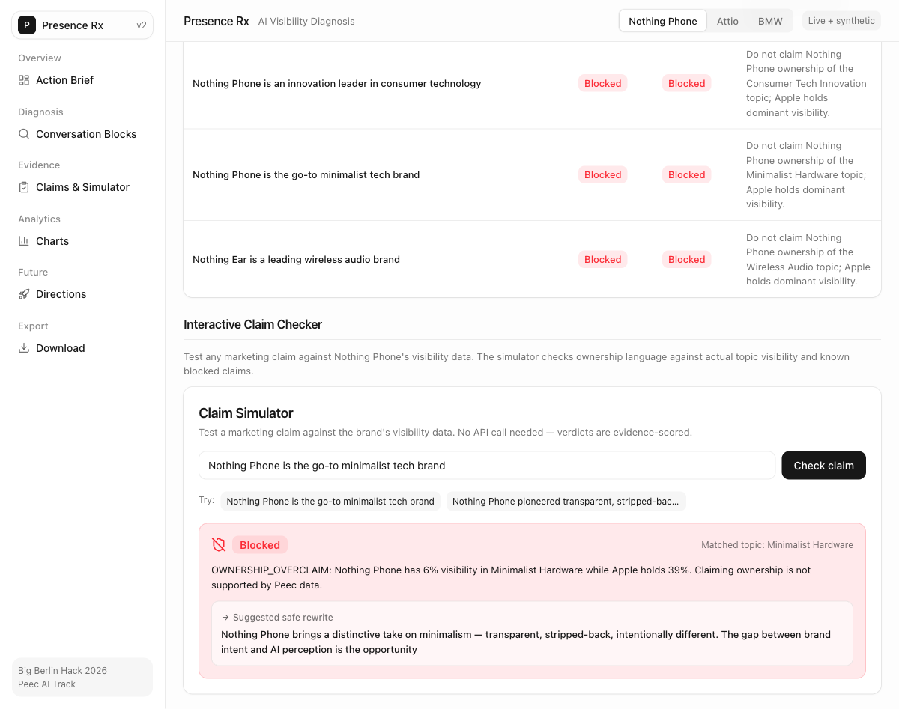
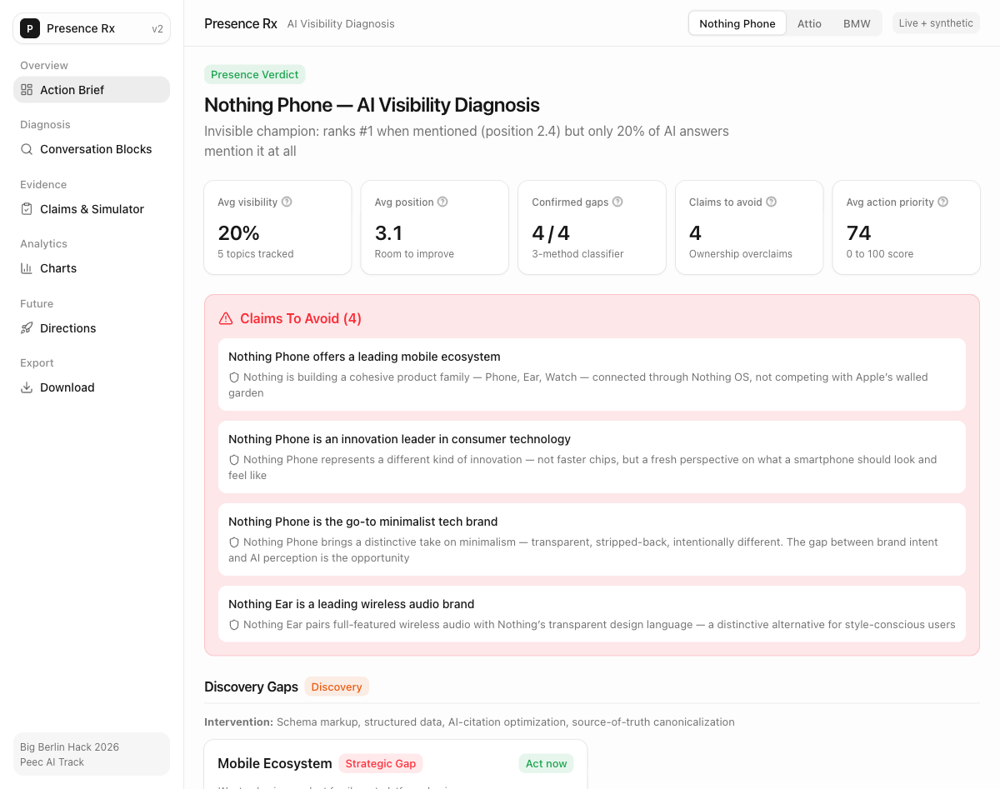

# Presence Rx

### Turn AI visibility gaps into evidence-backed marketing decisions: where to act, what to claim, and what to refuse.

> **Diagnose. Prescribe. Refuse.**

---

## It Can Say No

A marketer types into the claim simulator:

> *"Nothing Phone is the go-to minimalist tech brand."*

Presence Rx **blocks the claim**. Peec visibility data shows Nothing Phone has 6% visibility in Minimalist Hardware while Apple holds 39%. Claiming ownership is not supported by the evidence.

Then it provides a safer rewrite the marketer can actually use:

> *"Nothing Phone brings a distinctive take on minimalism — transparent, stripped-back, intentionally different. The gap between brand intent and AI perception is the opportunity."*

Not just what to say — what the brand has **earned the right to say**.



---

## The Problem

AI answers are the new discovery surface. When someone asks ChatGPT, Gemini, or Perplexity for a product recommendation, your brand is either in the answer or it isn't.

- *"We rank #1 when mentioned, but only 20% of AI answers mention us at all."*
- *"AI says we're innovative, but associates our core trait with a competitor."*
- *"Our product exists, but AI can't find it."*

[Peec AI](https://peec.ai) tells you *where* the gap is — which topics, engines, and competitors shape AI answers. Presence Rx adds the decision layer: what kind of gap, what to do about it, and what you can safely claim.



---

## The Workflow

Presence Rx is one workflow, not six separate dashboards. Each step answers the next question a marketer asks.

**Diagnose the gap** — Is this a perception problem, a discovery problem, or an attention problem? Each topic gets a classification, not just a score.

**Understand the reason** — Who owns this topic in AI answers? What do AI models associate with your brand versus the competitor? Where does perception diverge from intent?

**Choose where to engage** — Which channels and audiences should activate first, based on gap type and evidence, not generic best practices?

**Test the claim** — Type any marketing message into the claim simulator. It checks ownership language against actual visibility and blocks overclaims before they reach the market.

**Export the receipts** — Download the evidence ledger, action brief, and full case data. Every recommendation traces back to a named source.

---

## The Flagship Case: Nothing Phone

**The Invisible Champion.** Ranks #1 when mentioned (position 2.4) but appears in only 20% of AI answers. The brand is strong — it's just invisible.

Presence Rx diagnosed four strategic gaps across perception, discovery, and attention. It blocked four marketing claims that overstate ownership. It prescribed channel-specific actions and provided evidence-bounded alternatives for every blocked claim.

This case includes live Peec MCP visibility data, 40 Tavily web-evidence sources, and Gemini perception analysis across all gap topics.

**Also ships with:** Attio (SaaS CRM — invisible against Salesforce/HubSpot) and BMW (automotive — Tesla dominates EV answers). Same pipeline, same guardrails, different market.

---

## Architecture


### Source-of-Record Discipline

| Source | What It Provides |
|--------|-----------------|
| **Peec AI** | Visibility truth — topics, positions, competitors, engine coverage, source signals |
| **Tavily** | Public web evidence — editorial citations, proof-gap enrichment, 40+ sources |
| **Gemini** | Perception analysis — themes, missing associations, narrative diagnostics |
| **Presence Rx** | Decision layer — gap classification, claim ceilings, safe rewrites, action priorities |

Every metric traces to a named source. The system never blends signals without attribution.

### What We Deliberately Do Not Claim

- Presence Rx does not replace Peec. Peec is the measurement source of record.
- Engagement scores on the Directions page are modeled projections, not measured audience behavior. They are clearly labeled.
- The claim simulator is evidence-scored and intentionally conservative. It would rather block a borderline claim than let an overclaim through.

---

## Glossary

| Concept | What It Means |
|---------|--------------|
| **Strategic Gap** | A topic you want to own, but AI answers favor a competitor |
| **Owned Strength** | A topic you already dominate — defend it |
| **Perception Gap** | AI describes you with wrong or outdated traits |
| **Discovery Gap** | AI can't find you despite your content existing |
| **Attention Gap** | Not enough recent signal for AI to surface you |
| **Claim Ceiling** | The strongest claim the evidence supports without overstatement |

---

## Run It

```bash
cd webapp && npm install && npm run dev
```

Open [localhost:3000](http://localhost:3000). Select a brand. Start diagnosing.

<details>
<summary>Data pipeline and verification</summary>

```bash
# Pipeline
uv sync --dev
make run && make validate

# Verify
cd webapp && npm run build && npm run lint
make test && make lint
```

</details>

---

## Built With

[Peec AI](https://peec.ai) — AI visibility data via MCP |
[Gemini](https://deepmind.google/technologies/gemini/) — perception analysis and gap classification |
[Tavily](https://tavily.com) — public web evidence enrichment |
[Next.js](https://nextjs.org) + [Recharts](https://recharts.org) — dashboard

---

**Solo build by Amit Prusty with AI-assisted development.**
Peec AI track, Big Berlin Hack 2026. Berlin, April 25-26.
