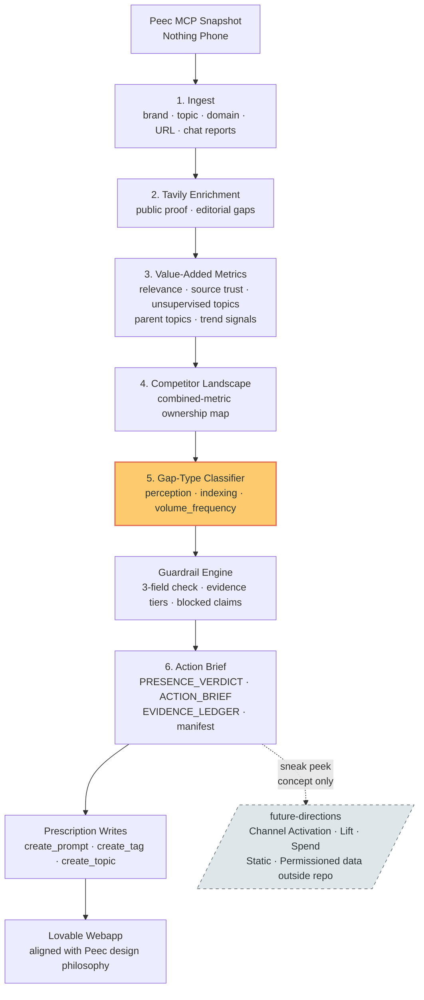

# Presence Rx

> **Diagnose. Prescribe. Refuse.**
> *Find your brand's blind spots in AI answers — and prescribe what to fix, what to test, and what not to claim.*

Big Berlin Hack 2026 implementation repo. Track: **Peec AI (locked)**. Briefing: [../AGENT_BRIEFING.md](../AGENT_BRIEFING.md). Battle plan: [../BATTLE_PLAN.md](../BATTLE_PLAN.md).

## Status

Track locked, brand locked on **Nothing Phone** (the Invisible Champion: best position 2.4 in field, 20% overall visibility, 4 of 5 topics with blind spots). Repo contains the public-safe methodology, artifact contracts, guardrails, end-to-end build guide, MCP exploration output, and integration checklist. Application code still needs to be built against real Peec MCP data and eligible partner-tech paths.

## Goal

Presence Verdict Pack via Peec MCP: multi-method analysis, guardrails, blocked-claim register, gap-type classifier, action brief.

**Primary tagline:** Diagnose. Prescribe. Refuse.
**Sub-tagline:** Find your brand's blind spots in AI answers.

## Solution Flow

The **gap-type classifier** (orange, step 5) is the new sharp moment: every blind spot carries a `perception` / `indexing` / `volume_frequency` label that triggers a different intervention class. The **Future Directions** node (dotted, step K) is concept-only on the public surface; the actual channel-activation prototype lives outside this repo (see [FUTURE_DIRECTIONS.md](docs/FUTURE_DIRECTIONS.md)).

## Core Artifacts

- `PRESENCE_VERDICT.md` - evidence-grade visibility diagnosis with gap-type classification
- `ACTION_BRIEF.md` - marketer actions grouped by intervention class, with "Claims To Avoid"
- `EVIDENCE_LEDGER.json` - every claim mapped to sources with blocked claims register
- `manifest.json` - snapshot metadata, taxonomy versions, pipeline summary, freshness

Optional artifacts: `pipeline_funnel.json`, `source_of_record.json`, `hero_cards.json`, `study_ssot.json`, `cluster_diagnostics.json`

## Partner Stack

- Gemini
- Tavily
- Lovable (dashboard surface)
- Peec MCP is the required track tool; eligibility toward the 3-partner minimum must be confirmed with organisers

## Submission

- Public GitHub repo + 2-minute video by Sunday 14:00 CEST.

## Multi-Agent

See [AGENTS.md](AGENTS.md) for lane assignments and coordination rules.

## Reusable Patterns

See [docs/ANALYTICS_PATTERNS_FOR_PEEC.md](docs/ANALYTICS_PATTERNS_FOR_PEEC.md) for public-safe analytics patterns: evidence ledger, claim guardrails, prompt universe routing, and the demo proof step.

See [docs/TREND_ECON_PATTERNS.md](docs/TREND_ECON_PATTERNS.md) for trend-analytics details: prompt clusters as trend objects, surge vs slow-burn, quality flags, SSOT, and strategic quadrants.

See [docs/PARENT_TOPIC_AND_UNSUPERVISED_PATTERNS.md](docs/PARENT_TOPIC_AND_UNSUPERVISED_PATTERNS.md) for parent-topic and unsupervised-topic mechanics: candidate topics, confidence filtering, parent themes, fallback topic sources, and coverage audits.

See [docs/CAMPAIGN_TAXONOMY_FOR_PEEC.md](docs/CAMPAIGN_TAXONOMY_FOR_PEEC.md) for the campaign category/type hierarchy that turns prompt-cluster findings into marketer-facing plays.

See [docs/PLANNING_AND_MEASUREMENT_PATTERNS.md](docs/PLANNING_AND_MEASUREMENT_PATTERNS.md) for scenario-planning, reporting, readiness gates, visible assumptions, and sparse-data behavior.

See [docs/METHOD_GUARDRAILS_AND_EVIDENCE.md](docs/METHOD_GUARDRAILS_AND_EVIDENCE.md) for method ladders, evidence strength tiers, method agreement, and claim language rules.

See [docs/ARTIFACT_CONTRACTS.md](docs/ARTIFACT_CONTRACTS.md) for the initial JSON artifact contracts.

See [docs/END_TO_END_BUILD_GUIDE_AND_STORYBOARD.md](docs/END_TO_END_BUILD_GUIDE_AND_STORYBOARD.md) for the complete build order, data flow, dashboard wireframes, and 2-minute demo storyboard.

See [docs/VALIDATION_REPORT.md](docs/VALIDATION_REPORT.md) for the current repo validation status, implementation gaps, and next build cut.

See **[docs/SCOPE_FINAL.md](docs/SCOPE_FINAL.md)** — the locked, rated scope for the build. 22 features across 4 tiers, 6-axis blind-spot model (Topic / Channel / Engine / Geography / Authority / Evidence), eligibility-critical lane explicit, build priority order with submission gates. **Read this first.**

See [docs/INTEGRATION_CHECKLIST.md](docs/INTEGRATION_CHECKLIST.md) for the active integration checklist (auth, brand strategy including custom-project workflow, partner wiring, pipeline build, submission gates).

See [docs/PEEC_MCP_EXPLORATION.md](docs/PEEC_MCP_EXPLORATION.md) for the verified MCP exploration output: project inventory, brand IDs, topic IDs, prompt summary, channel and engine breakdowns, gap URLs, metric definitions, and tool-to-pipeline mapping.

See [docs/FUTURE_DIRECTIONS.md](docs/FUTURE_DIRECTIONS.md) for the channel-activation roadmap (concept-only, sources the static `/future-directions` page in the Lovable webapp).

See [docs/DESIGN_TOKENS.md](docs/DESIGN_TOKENS.md) for the Lovable webapp design constraint — must follow Peec AI's visual philosophy.

See [docs/PUBLIC_SAFETY_CHECKLIST.md](docs/PUBLIC_SAFETY_CHECKLIST.md) before committing, pushing, recording, or making the repo public.
